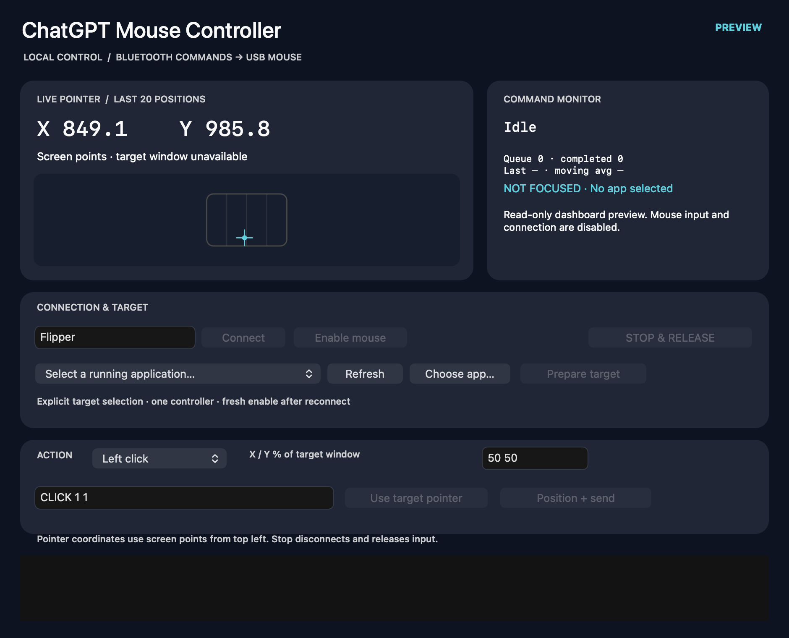

# ChatGPT Mouse Controller

A local Mac dashboard and **AI HID CTRL** Flipper Zero companion for supervised USB mouse control. Bluetooth transports bounded commands; the Flipper delivers USB HID input. The controller works with an explicitly selected application. It contains no game-specific startup, triggers or gameplay logic.

This is a personal project, not an official OpenAI product. “ChatGPT” names the intended collaboration workflow; the app has no ChatGPT/API connection, cloud service, account, telemetry or background automation.



## Version 0.4 — installed display update

Mac 0.4.0 build 5 and AI HID CTRL 0.4 are installed. The Mac map uses a fading tail of the last 20 positions. The Flipper keeps logical screen X/Y visible through a bounded idle-channel feed and marks readings OLD after one second without an update. Live reconnect and coordinate acknowledgements passed with mouse control disabled after the owner refreshed the existing Bluetooth permission. See [release evidence and limits](docs/Pointer-Display-v04.md).

## Version 0.3 — historical supervised qualification passed

**Verified on the final installed build:** GUI startup, reconnect and full relaunch; browser mouse buttons/double click, both scroll directions and drag;20/20 positioning targets within4 logical points (mean1.131 seconds); fresh-arm enforcement and normal Stop/USB restoration. The earlier GUI startup gate was resolved by refreshing the existing Bluetooth grant for the installed executable. Physical BACK, held-button connection loss, sleep/wake and multi-display behavior remain unqualified.

- Exact running-app selection by PID, or an application file for optional launch.
- Live screen coordinates in logical points, target-window coordinates/percentages and a desktop pointer map with trail.
- Active/last commands, queue depth, command count and measured Bluetooth-command latency.
- Bounded adaptive positioning, 50 ms observation settling, no center movement during preparation and no redundant `MOVE 0 0` round trip.
- Focus/window verification at dispatch, one positioning task, bounded queue/expiry, fresh arming, Stop/disconnect recovery.
- Flipper display: SAFE/ARMED, BLE/USB status, active/last command, processed command count, last execution duration and physical BACK to stop/release.

Speed improvement must be measured on equivalent targets. Historical version0.2 averaged1.49 seconds for20 targets; this is not a v0.3 performance claim. See [revision review and qualification](docs/General-Purpose-Controller.md).

The companion app-list name and device header are now **AI HID CTRL**. The Mac app remains ChatGPT Mouse Controller. A later Kingshot run passed Connect/ARM but failed its focused-visible-window Prepare check; that game-specific condition remains unresolved despite browser qualification.

## Build

```sh
sh scripts/build-mac.sh
python3 tests/test_mouse_commands.py
python3 -m venv .venv
.venv/bin/pip install ufbt==0.2.6
.venv/bin/ufbt update --branch=1.4.3
cd flipper_mouse
../.venv/bin/ufbt
```

Optional stable app signing: set `MOUSE_CODESIGN_IDENTITY` to an existing Apple Development or Developer ID identity before building. The default is ad-hoc signing; changed builds can invalidate macOS privacy grants even while Settings shows them enabled. Git commit signing is separate from app signing. No certificate/account is provisioned by this script.

The build prints a verified temporary Mac bundle and also copies it into `dist/ChatGPT Mouse Controller.app`. Cloud-sync metadata can invalidate the copied bundle signature; verify the installed copy from the temporary build. The Flipper build produces `flipper_mouse/dist/ble_usb_mouse.fap`; transfer to `/ext/apps/Tools/ble_usb_mouse.fap` only after stopping the old controller and confirming ordinary USB is restored. Keep a backup of the prior FAP. Official firmware1.4.3/API87.1/target7 is the build target; no firmware replacement is required.

## Dashboard

Keep USB connected, enable Bluetooth, close qFlipper. Select the exact running target (or Choose app), enter a distinctive Flipper name, Connect, then Enable mouse after Ready. Prepare target focuses it and checks a visible window; it does not click or move the pointer. Confirm the target screen has loaded before any action.

Choose a command and X/Y percentages measured from the target window’s top-left. Position + send focuses the target, moves via observed HID corrections, rechecks guards, and executes. Use target pointer copies the last observed pointer within that selected window (up to30 seconds old, with unchanged window geometry) into the percentage fields; it does not send input. Confirm the intended control before sending. Stop disconnects, cancels queued work and releases buttons on the Flipper.

Read-only preview: `mouse-bridge --dashboard-preview`. Offline visual QA: `mouse-bridge --render-dashboard /absolute/path/preview.png`. Neither mode sends commands or takes controller ownership.

## CLI

```text
mouse-bridge --cli DISTINCTIVE_DEVICE_NAME
ARM
TARGET EXACT_RUNNING_PID
PREPARE
STATUS
ACTION 50 50 CLICK 1 1
ACTION 40 60 DRAG 0 240 500
POINT 800 400
HERE SCROLL -3
DISCONNECT
CONNECT DISTINCTIVE_DEVICE_NAME
ARM
STOP
```

`TARGET` accepts a PID or a unique running bundle ID; ambiguous matches fail. `APPLICATION /absolute/path/Selected.app` selects a particular installation; `PREPARE` may launch it. `ACTION X% Y% COMMAND` focuses/positions/checks the selected target. `POINT X Y` uses global screen points and requires target focus. Raw mouse commands and `HERE` are also guarded at the current pointer. Only PING/ARM and display-only POS bypass target selection. No old game default remains: existing integrations must explicitly select their target. STOP exits the CLI; DISCONNECT preserves its process. Reconnect never replays work or arms automatically.

| Command | Bounds |
|---|---|
| PING / ARM | Connection health / enable this session |
| POS x y | Display-only logical screen coordinates; each axis −99999…99999 |
| MOVE x y | Each axis −127…127 HID counts |
| CLICK button count | Button1 left,2 right,4 middle; count1…2 |
| SCROLL delta | −127…127; vertical wheel |
| DRAG x y ms | Each axis −2000…2000 counts;100…3000 ms |

Coordinates are logical screen points, not Retina pixels or HID counts. Native Apple/CUA remains preferred when it works; use hardware for a specific observed failure. Target focus/geometry guards do not continuously guarantee focus throughout a held drag; supervise it. Trackpad pinch/rotation and horizontal scrolling are outside this protocol.

## Records

- [Progressive development history and checkpoints](docs/Development-History.md)
- [General-purpose revision and device dashboard design](docs/General-Purpose-Controller.md)
- [Original development paper](docs/Development-Paper.md)
- [Historical validation](docs/Validation.md) and [v0.2 qualification](docs/Refined-App-Qualification.md)
- [Roadmap](docs/Roadmap.md)

Historical game tests are dated evidence; application-specific launch/routing policy belongs to the client workflow. Personal device identities, raw logs, account data and private vault notes are excluded from this repository.
