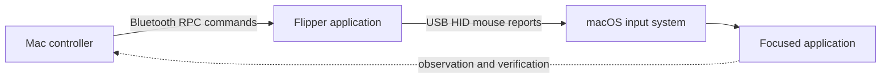

# Flipper Mouse Bridge: restoring usable mouse input for Kingshot on macOS

Development paper · 7 October 2026 · version 0.1.0

## Abstract

A Flipper Zero successfully delivered USB mouse input to a MacBook Pro while receiving commands from that same Mac over Bluetooth. Browser tests confirmed three mouse buttons, double-click, vertical scrolling, sustained dragging, and cancellation. A subsequent test in the native macOS Kingshot application confirmed that bounded left-button drags panned the city map in both directions without opening a building panel. This establishes a working input path for supervised gameplay interaction. It does not establish complete game automation or a general repair of macOS mouse handling.

The practical contribution is a small, inspectable bridge that separates the command channel from the mouse channel. Bluetooth carries application commands; USB carries ordinary HID mouse reports. The Flipper executes a complete timed drag locally, so the held-button sequence does not depend on the timing of individual Bluetooth messages.

## 1. Problem and intended outcome

The intended outcome was to let an assistant operate a Flipper connected to the user's MacBook Pro and use it to perform mouse actions in Kingshot. Reliable dragging mattered because map navigation requires a button-down event, movement while the button remains held, and a button-up event. A tap at the end of a requested drag does not provide that sequence.

Earlier Kingshot work through iPhone Mirroring had encountered a drag that behaved as a tap. That observation motivated the experiment, but the present successful game test used the native macOS application. It therefore does not prove that iPhone Mirroring was repaired. The test also exposed two distinct operational requirements: the intended application must have focus, and the physical pointer must start over the intended area. A coordinate-based automation click did not relocate the physical pointer for this HID path. The user positioned it with the trackpad before the game test.

The initial scope was movement, left/right/middle click, double-click, vertical scrolling, and bounded left-button dragging. Precision targeting, screen interpretation, multi-step gameplay, horizontal scrolling, extra mouse buttons, and trackpad gestures were outside this first implementation.

## 2. Design decision: Bluetooth control and USB input

The command route uses Flipper's Bluetooth RPC service. The Mac starts the external Flipper application and supplies short text commands through application RPC data. The Flipper temporarily selects its USB mouse configuration and sends relative movement, button, and wheel reports.

Separating the routes solves a practical channel conflict: while the Flipper presents as the USB mouse, its ordinary USB serial connection is unavailable. Bluetooth remains available to control the running application. On normal shutdown, the application releases mouse buttons and restores the previous USB configuration. No replacement firmware was installed.

This is not an entirely wireless mouse solution. The USB cable remains necessary for mouse input. A future Bluetooth HID output design would need a compatible command route and a separate validation exercise; simply removing the cable does not preserve this architecture.

## 3. Implementation

The Flipper application is written in C and targets official firmware 1.4.3, API 87.1, hardware target 7. It receives commands into a bounded queue of eight entries, each with a 96-byte text buffer. It requires explicit session arming before executing mouse commands. Its local display exposes connection/arming state and a physical BACK exit.

The Mac application is written in Swift using CoreBluetooth and AppKit. It discovers a matching advertised device, establishes the RPC connection, starts the Flipper app, and submits commands serially. Its RPC framing code handles variable-length integers, nested fields, and partial incoming frames. Command handling uses a ten-second timeout. Discovery itself still needs a clearer bounded timeout and recovery path.

The controller has a window and a standard-input mode. The window defers mouse commands for three seconds so the operator can focus the intended application. PING and ARM are immediate. Sending another command cancels a pending deferred command; Stop cancels it and ends the session. The live gesture tests used standard-input mode. The control window opened and its Stop function worked, but its delayed gesture workflow remains to be qualified live.

The public source replaces the original device-name default with a configurable name substring. That portability change was compiled and its protocol tests were repeated; the hardware and game results below belong to the original installed build. The installed working application was retained.

## 4. Command contract

| Command | Behavior and limits |
|---|---|
| `PING` | Returns `PONG`; no pointer action |
| `ARM` | Enables mouse commands for the current session |
| `MOVE x y` | Relative mouse counts; each axis −127 to 127 |
| `CLICK button count` | Button 1 left, 2 right, 4 middle; count 1 or 2 |
| `SCROLL delta` | Vertical wheel; delta −127 to 127 |
| `DRAG x y ms` | Left button held; each displacement −2000 to 2000; duration 100–3000 ms |
| `STOP`, `RELEASE`, `QUIT` | End the control session and release buttons |

Clicks hold for 40 ms, with an 80 ms gap between the two clicks of a double-click. Drags include an 80 ms initial hold, then interpolate movement over the requested duration in roughly 10 ms steps, then release. The duration parameter describes the movement interval; total command time includes the initial hold and transport overhead. Individual USB movement reports remain within the HID signed-byte limits.

Relative HID counts are not display pixels. macOS pointer acceleration, report timing, display scale, and application behavior affect the resulting screen distance. An acknowledgement confirms command processing, not that the intended game state was reached. Screen verification must establish that separately.

## 5. Failure handling and recovery

No command requests an indefinite held button. Drag duration and displacement are bounded. Completion, cancellation, and report failure attempt button release. Closing the RPC session stops the Flipper application. The Mac clears pending commands when stopping. The application restores normal USB operation on ordinary exit.

The browser test confirmed cancellation during an active drag and observed button-up. Normal USB serial operation returned after stopping. Reconnection also succeeded, although discovery sometimes took time. Physical BACK is implemented but has not yet been pressed during a live qualification test. Abrupt power loss, cable removal, host sleep/wake, and long-duration reliability have not been tested. These distinctions are part of the release evidence, not inferred successes.

For recovery, stop the controller or press BACK, confirm normal USB operation, reopen the controller, wait for readiness, send PING, and arm a fresh session. Future automatic reconnection must not replay a previous mouse action without a fresh decision.

## 6. Validation method and results

Validation used three layers: protocol/command tests, a browser fixture that recorded pointer events, and a narrow native Kingshot test. The C test harness extracts the actual command functions rather than recreating their logic. It substitutes a mock USB interface to examine bounds, timing, cancellation, and failed reports. These tests cannot establish macOS event delivery; the live layers provide that evidence.

| Test | Observed result |
|---|---|
| Swift RPC framing | Passed integer boundaries, partial frames, nested application data, truncated fields |
| Actual C command handler | Passed arming, bounds, double-click timing, scroll, interpolation, cancellation, failed reports, release |
| Device installation | Flipper file read-back SHA256 matched the built FAP |
| Mac packaging | Installed local application passed strict ad-hoc signature verification |
| Connection | Bluetooth pairing completed; PING/PONG and ARM/ARMED succeeded |
| Clicks | Browser observed left, right, and middle button down/up and auxiliary clicks |
| Double-click | Browser reported a double-click event |
| Wheel | `SCROLL -3` produced a browser wheel event; observed delta approximately −4.00024 |
| Drag | `DRAG 120 -60 800` produced 62 held-button movement events and release; fixture target moved from 100,100 to about 143,78 |
| Cancellation | Stop during `DRAG 500 0 3000` released after approximately 19 screen points of motion |
| Kingshot | `DRAG 240 0 1000` panned the city map right; the reverse command panned it left; no building panel opened |
| Shutdown/reconnect | Normal USB serial returned; a further session reached readiness |

The user placed the physical pointer over open ground near the center of Kingshot before the game test. The two opposing pans demonstrate that this input path can deliver a sustained drag that the native game accepts. They do not qualify every game control, exact target positioning, or unattended workflows. No purchases, attacks, or messages formed part of the test.

Verified FAP SHA256: `30836d1a1fe2e390af5b0965ffb1f37ada746e6c264c1c09034d0e63d5c6c995`.

## 7. What was fixed, and what remains uncertain

The successful change was the input-delivery path. The Flipper delivered a real held-button movement sequence through USB HID, and the focused native Kingshot application responded with map panning. This addressed the immediate interaction failure for that tested action.

There is insufficient evidence to name a general macOS defect or a single root cause covering the earlier iPhone Mirroring attempt. Focus, physical pointer position, gesture delivery, and the application environment are distinct factors. The project provides a verified workaround for the tested native-game interaction; it does not diagnose every preceding failure.

## 8. Optimization assessment

The best next investment is feedback-based positioning. A controller should observe the pointer and target window, convert display coordinates consistently, issue a bounded correction, and confirm the final position before clicking. Relative counts should never be assumed to equal pixels. Calibration should cover small and large moves, both axes, and different report timings.

| Priority | Proposed improvement | Qualification target |
|---|---|---|
| P0 | Screen feedback, pointer location, Retina/window coordinate conversion | Twenty harmless targets across the window, each within four logical points; no unintended clicks |
| P0 | Device picker, remembered peripheral, bounded discovery/retry, explicit disconnected/ready/armed states | Reconnect predictably, require fresh ARM, never replay a prior input |
| P0 | Live fault and cancellation matrix | Verify BACK, Bluetooth loss, cable removal, sleep/wake, and deferred-command cancellation; record each separately |
| P1 | Screen-aware gameplay actions | Qualify map pan, open a harmless known panel, and return; verify state after every step |
| P1 | Motion and latency measurement | Record command-to-action latency and positioning error before tuning report frequency or acceleration assumptions |
| P1 | Reproducible builds and compatibility matrix | Pin firmware/SDK and tool versions; repeat checks on each supported Mac/firmware combination |
| P1 | Sanitized operational logs | Capture command, acknowledgement, latency, and verification outcome without private account content |
| P2 | Broader distribution | Choose a license, release process, signing/notarization strategy, and contributor guidance before wider reuse |
| P2 | Additional input capabilities | Add only demonstrated needs; horizontal wheel/extra buttons require compatible HID support and new tests |

These are proposed acceptance targets, not measured performance claims. Apple provides a cached-peripheral retrieval API that could support remembered-device reconnection, but the proposed recovery behavior has not been implemented. A device identifier alone does not establish that the device is presently reachable.

For the user's intention—assistant-assisted Kingshot operation—the complete loop is observe, choose a bounded action, deliver input, and verify the resulting screen. The bridge currently supplies the input-delivery component. Stable positioning and state verification matter more than adding a large collection of unverified game macros.

## 9. Reproduction and project boundaries

Build the Mac controller from the supplied Swift source, build the Flipper app against the pinned official firmware, install the FAP, grant Bluetooth access, and pair the device. Keep USB connected. Qualify commands in the browser fixture before operating another application. The README contains the build and operating procedure; the validation record distinguishes tested behavior from pending work.

The public repository contains source, a browser fixture, command tests, build instructions, this paper, and a roadmap. Personal vault indexes, device identity, local installation paths, raw logs, game account screenshots, SDK caches, and credentials are excluded. No background service or recurring gameplay schedule was installed.

## References

- [Official Flipper firmware 1.4.3](https://github.com/flipperdevices/flipperzero-firmware/tree/1.4.3)
- [Flipper application RPC API](https://github.com/flipperdevices/flipperzero-firmware/blob/1.4.3/applications/services/rpc/rpc_app.h)
- [Flipper USB HID API](https://github.com/flipperdevices/flipperzero-firmware/blob/1.4.3/targets/furi_hal_include/furi_hal_usb_hid.h)
- [Official uFBT build tool](https://github.com/flipperdevices/flipperzero-ufbt)
- [Apple cached-peripheral retrieval](https://developer.apple.com/documentation/corebluetooth/cbcentralmanager/retrieveperipherals(withidentifiers:))

## Automated focus and pointer test — 7 October 2026

PASS for an assistant-orchestrated sequence with no user pointer placement. The bridge was launched in CLI mode, Bluetooth connected, and PING/PONG and ARM/ARMED confirmed. The already-running native Kingshot window was raised. A read-only CoreGraphics observer measured the physical pointer in logical screen coordinates; bounded Flipper MOVE commands corrected its position into clear ground. A Flipper left click activated Kingshot, confirmed by the frontmost application name. A further move and left click selected the Infirmary: the game displayed “30 Infirmary” and Details/Heal controls. No Heal action was taken.

Window raising alone did not activate Kingshot; the harmless ground click established focus. Relative HID counts were corrected against measured cursor location, rather than assumed to equal pixels. STOP disconnected the command channel successfully; the normal USB serial device reappeared afterward.

This demonstrates automated bridge startup, window presentation, physical pointer positioning, focus and a building-selection click. It does not qualify cold-starting a closed game, macOS full-screen mode, a standalone one-button routine, or the twenty-target precision acceptance criterion. The game was already open, and the assistant chose corrections from observations. The GUI control window was closed during CLI operation, so its absence did not mean the bridge was stopped.

## Broad Kingshot navigation qualification — 7 October 2026

Castle and world maps passed four-direction and diagonal dragging. Building details, Heroes and its Stats/Skills/Gear tabs, all five Backpack categories, Alliance members, Events tabs/task list, Governor Profile and Conquest navigation were verified. Scrollable lists responded to held left-button dragging. Isolated wheel commands produced no visible scrolling or zooming in the tested game surfaces. Right/middle clicks and a world-ground double-click were acknowledged but had no distinct useful effect. No user pointer placement was needed. The game returned to castle view; STOP restored normal USB and the controller exited.

Read the [full qualification report](Kingshot-Qualification.md) for individual outcomes, method, limits and priorities. This broad navigation test does not qualify every game action, full-screen mode, cold startup, fault recovery or unattended gameplay.
