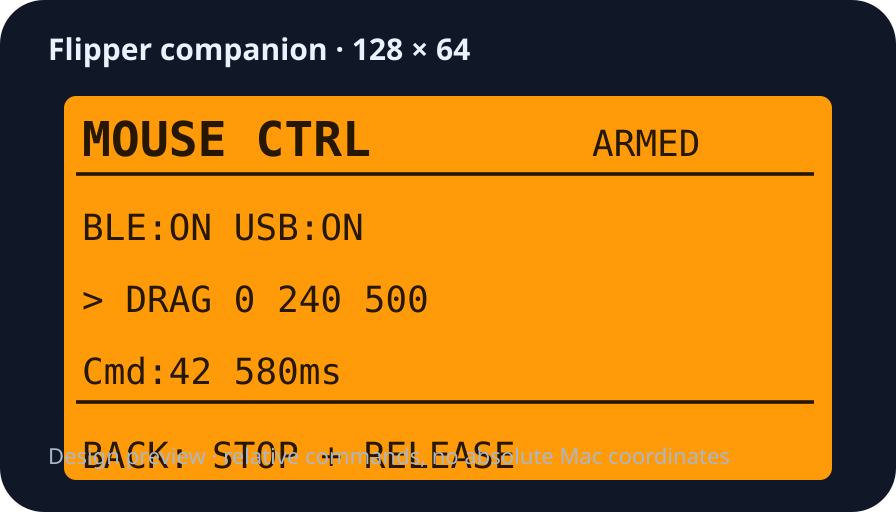

# General-purpose controller and companion dashboard — v0.3

Status: **v0.3 candidate; GUI Bluetooth startup unresolved.**

Date:2026-10-08, Asia/Hong_Kong. Lead-performed design/code review; no independent reviewer was dispatched.

## Problem and decision

The v0.2 controller embedded one game’s bundle ID and startup behavior. During the latest client session, preparation stalled until the exact running installation was selected; hardware scrolling then worked. Native event-tab dragging still became an endpoint tap. These are distinct issues: application identity/focus in the bridge, and per-view routing in the client.

The controller now owns transport, observation, guarded targeting, timing and presentation. Client workflows own application discovery/startup, view recognition, action permissions and native-versus-hardware routing. No game identifier or game-specific startup preference remains in active source. The bundle ID and controller lock location remain stable to prevent competing legacy/new controllers and preserve existing preferences.

## Architecture

`Client workflow → selected app/PID + bounded command → Mac observation and dispatch guard → Bluetooth RPC → Flipper command handler → USB HID → target`

Mac modules: `ControlPanel.swift` presents controls/telemetry; `PointerMap.swift` draws a local geometry map; `TargetController.swift` handles exact app selection, focus and feedback; `MouseBridge.swift` serializes RPC and measures latency; `BridgeSupport.swift` validates input, queue and ownership; `main.swift` routes GUI/CLI and offline checks.

Runtime is local/self-contained. System AppKit/CoreGraphics/CoreBluetooth supply the UI, observation and transport. No server, cloud/API call, telemetry upload, external runtime or keyboard injection was added.

## Efficiency changes and evidence limits

1. Preparation only focuses/verifies a visible window. It no longer pays for a center movement unrelated to the next control.
2. If the pointer is already within4 points, positioning immediately succeeds. A position-only `MOVE 0 0` check completes locally.
3. Feedback settling drops from100 to50 ms after successful move completion. Axis gains adapt from bounded observed HID displacement; incompatible/opposite/outlier feedback is discarded. Report limits,32 corrections and8-second deadline remain.
4. Release compilation uses Swift optimization. One RPC remains active; no batching/replay of consequential commands was introduced.
5. Display observation is10 Hz while visible; window geometry polling is2 Hz. Pointer-map repaint occurs only when point/geometry changes. These observations add no Bluetooth requests.
6. Command timing runs from dispatch to response completion. It excludes queue wait and app focus/positioning. Last latency and exponential moving average are diagnostic, not total-action speed claims.

Controlled equivalent-target hardware measurements are required before calling this faster. Gains can vary with macOS acceleration, display geometry and interference from manual pointer movement. Never infer pixel displacement from HID counts.

## Review and corrections before installation

- Removed ambiguous bundle-ID startup searches. PID selects the exact running app; choosing an application file matches its installation URL. No automatic target selection on launch.
- Added a final focus/geometry/generation guard when each queued movement/action dispatches, closing the gap between enqueue and actual send.
- Preserved queue limit8,5-second expiry, single positioning task, cancellation generation, exclusive process lock and fresh ARM after reconnect.
- Replaced a nonfunctional “send at pointer” dashboard idea: clicking the dashboard changes focus. “Use target pointer” instead copies a recent observed target point into percentage fields without input. CLI HERE requires current target focus.
- Kept the device display’s command data synchronized in a small snapshot; paint does not hold the RPC lock.
- Added a pointer-distance check at actual action dispatch; moving the pointer after positioning prevents the queued action. Saved dashboard coordinates are rejected when the selected window geometry changes.
- Added standard Quit behavior and compact connection labels; Bluetooth initializes on Connect so read-only previews make no transport requests.
- Kept old app/FAP recoverable. No companion replacement while another chat owns the controller.

## Flipper dashboard assessment and design

The companion’s128×64 display is appropriate for a compact execution/status dashboard, not a miniature Mac desktop. It has no independent view of the Mac pointer. Absolute X/Y would require host telemetry; this revision deliberately avoids that extra transport load and any misleading synthetic position.

| Row | Content | Meaning |
|---|---|---|
| Header | MOUSE CTRL · SAFE/ARMED | Host has enabled this session or input is disabled |
| Transport | BLE:ON/OFF · USB:ON/OFF | RPC session present and USB HID connected |
| Command | `>` busy, `o` ended, `!` error + command | Active/last bounded command, not a semantic game action |
| Timing | Cmd:N · last ms | Processed-command count, including checks/errors; execution duration excludes Bluetooth latency |
| Footer | BACK: STOP + RELEASE | Physical emergency exit releases buttons and restores previous USB |

Display updates at command boundaries and every250 ms when idle. Long drags show the command as busy; no live percentage progress or absolute Mac coordinates is claimed. The Mac displays the live pointer and transport timing. Firmware remains official1.4.3; the external companion app changes to0.3.

## Verification and remaining qualification

Both native Mac and Flipper builds compile. Mac self-tests cover command bounds, queue expiry/cancellation/dispatch guard, adaptive-step limits and invalid feedback, and RPC framing. The existing harness executes the actual C input handler for arm/bounds/click/scroll/drag/interruption/report failure/button release. Offscreen Mac dashboard render was visually reviewed without activating a window or competing with gameplay.

Installed hardware results and the remaining GUI release gate are recorded below. USB removal, Bluetooth interruption while held, sleep/wake, multi-display/Spaces and long-session behavior are separate fault qualifications; successful compilation is not those tests. Existing historical0.2 hardware qualifications apply only to that version.

## Installation and rollback

Install the verified temporary Mac bundle as ChatGPT Mouse Controller.app; retain Flipper Mouse Bridge.app. Both share one controller lock, so only one can run. Back up the original companion FAP, replace it while normal USB is available, read it back and compare hashes. Stop/close controller before reverting either component. The unchanged protocol allows the new Mac controller to work with the old FAP, which lacks the new dashboard. Do not automatically roll back/replay after an uncertain action result.

## Installed hardware qualification — 8 October 2026

The companion0.3 was installed and read back byte-for-byte. On a generic browser mouse fixture, the preceding v0.3 Mac build passed left/right/middle click, double click, vertical scroll and held-button drag. The observed first action set had6 down/6 up events,4 clicks,1 double click and41 drag events; both wheel directions subsequently returned DONE. No game action was issued by this qualification.

Twenty movement-only targets passed: mean positioning1.117 seconds, mean error3.50 points, maximum3.99 points. Three exact-PID preparations passed. Same-process disconnect/reconnect rejected movement before fresh ARM; PING and normal STOP passed and normal USB returned. These are observed results on a browser window, not an equivalent-target comparison against v0.2 or qualification of every macOS app.

**GUI release gate:** launching the dashboard succeeded, but repeated Connect attempts left CoreBluetooth state at unknown until the15-second timeout. No ARM or mouse action was sent from those GUI sessions. Stop and Quit cleared the session; no controller process remained. Filtered CoreBluetooth logs showed an authorization request not completing; this is a lead, not proof of a permission cause. Moving initialization to Connect did not resolve the live GUI attempt. The final diagnostic build distinguishes initialization timeout from device discovery failure, reports authorization state and avoids stopScan when Bluetooth is not powered on. Apple documents the Bluetooth purpose-string requirement and authorization property ([Core Bluetooth](https://developer.apple.com/documentation/corebluetooth), [Designing for Privacy](https://developer.apple.com/videos/play/wwdc2019/708/)); the purpose string is present. Do not reset privacy permissions broadly or claim the issue repaired without another GUI test.

The final post-test changes (pointer dispatch guard, saved-window guard, compact labels and Bluetooth diagnostics) passed compilation/self-tests/C-handler checks and installed signature verification, but have not repeated hardware or GUI qualification. Hardware ownership was released to the client workflow, and no further device or pointer test will run during its active session. The Flipper display was compiled/installed but its physical legibility and BACK behavior remain unobserved.

## Next acceptance sequence

1. After the client releases control, inspect app Bluetooth authorization and capture a bounded GUI-only initialization test; identify the startup cause before adding transport complexity.
2. Repeat Connect/Enable/exact-target Prepare/position/click/drag/Stop on the final build, plus pointer displacement and moved-window rejection. Record startup/timeout outcomes, not just successful retry.
3. Measure the same target sequence with old/new controller under the same display/acceleration conditions before claiming a speedup. Include queue wait, focus, positioning and dispatch in total-action timing.
4. Observe the actual Flipper screen and physical BACK; then qualify Bluetooth loss during drag, cable removal, sleep/wake, multiple displays/Spaces and a longer session.
5. Integrate the qualified generic controller into the client’s own startup/routing policy. Keep native control preferred per function/view and require visual outcome checks before uncertain retries.

## Startup investigation — resumed after gameplay stop

The user stopped the gameplay client early and ownership was explicitly released. The installed diagnostic build reported Bluetooth authorization0 (not determined), while System Settings showed the controller's Bluetooth switch enabled. Filtered TCC info logs rejected the requesting executable against the previously stored cdhash requirement and attempted a Bluetooth prompt. This directly supports an app-identity mismatch; successful repair still requires permission refresh and fresh launch qualification. The Mac has no valid app-signing identity available. Apple DTS recommends an Apple Developer signing identity during development ([Apple Developer Forums](https://developer.apple.com/forums/thread/663889)).

Source now separates cancellable Bluetooth initialization (60-second deadline) from actual device discovery (15 seconds after powered-on). Stop remains available while initialization waits. The build accepts an optional existing `MOUSE_CODESIGN_IDENTITY` instead of forcing ad-hoc signing. No new certificate, account, broad privacy reset or relaxed signing requirement was created. These changes compile and self-tests pass; they are not yet installed/hardware-qualified.

Only this controller's existing Bluetooth grant is being refreshed. System Settings requested owner Touch ID before applying the change; that step is pending. Leave the installed bundle unchanged until the owner completes the off-toggle, then install the final verified build before re-enabling the grant so it binds to the final executable. Do not repeat a rebuild after granting permission and claim that grant still qualifies the new code.
