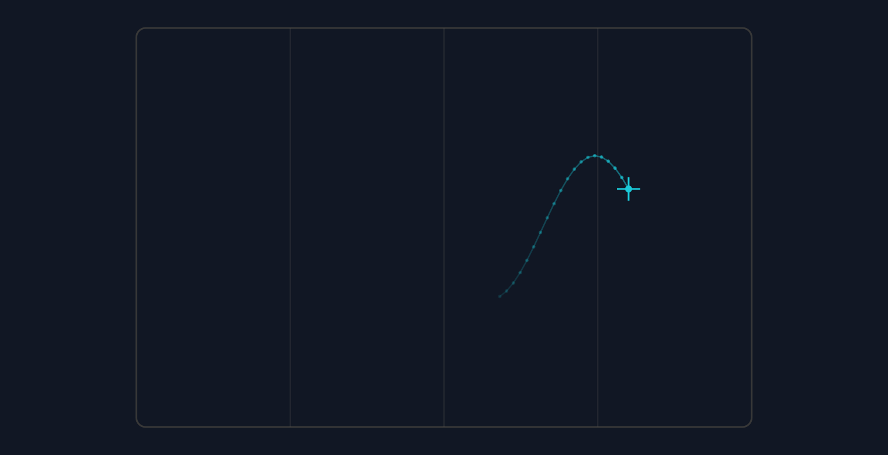
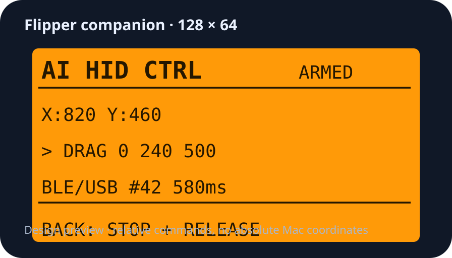

# Version 0.4 — pointer trail and device coordinates

Date: 2026-10-08. Mac: 0.4.0, build 5. Flipper: AI HID CTRL 0.4. Official firmware 1.4.3, target 7/API 87.1 retained.

## Problem and result

The desktop pointer map accumulated too much history. It now retains the last 20 distinct observed positions, draws a thin fading tail and small past-position dots, and preserves the bright current-position crosshair. Invalid pointer observations clear the trail. This is a position-count limit, not a timed fade; a stationary pointer keeps its recent tail.

The Flipper previously showed command and transport status but no absolute pointer coordinates. Its display now keeps X/Y logical Mac screen points visible, with SAFE/ARMED, current/last command, BLE/USB state, action count, duration and BACK release instructions. Coordinates are rounded integers; negative positions are supported. They are not Retina pixels, HID movement counts or window percentages.

This preview renders the production PointerMap with 60 synthetic positions; only the final 20 appear. It is visual QA, not a hardware measurement.

This is a layout illustration, not a photograph of the installed display.

## Coordinate flow and efficiency

The Mac dashboard observes the pointer every 100 ms. Display-only `POS x y` messages are sent at most once every 250 ms while connected and while the shared RPC channel is idle. The CLI has a 250 ms observation timer. GUI scheduling can yield a lower rate; this is an upper bound, not a guaranteed 4 Hz feed.

The Flipper acknowledges `POSITION`, stores the coordinates under its display mutex, and redraws. POS never emits a USB HID report, does not require arming, and does not replace the visible mouse command, increment action counts or contaminate action latency measurements. Coordinate messages are not accumulated behind mouse actions. Updates pause while positioning or a gesture is busy; after one second without a fresh coordinate the Flipper labels the retained reading **OLD**. During bounded gesture waits its viewport refreshes so this label can appear. The device cannot independently observe absolute Mac coordinates.

One already-dispatched display update may add an RPC round trip before a newly requested action. No parallel RPC channel or throughput improvement is claimed. Long-session overhead, measured rates under load and real-time coordinates during an uninterrupted drag remain future qualification work.

## Focus reliability

The existing exact-target activation fix is included: unhide and request all windows, then use Launch Services for the exact running app installation if focus has not taken effect after 250 ms. Generation/PID checks prevent a cancelled or changed selection from being retargeted. Dispatch still requires the selected focused visible window; activation is not proof of focus. Earlier CLI town navigation supplied evidence for this fallback; this release does not claim a new GUI game-focus qualification.

## Verification and installation

- Swift protocol/pointer/queue/RPC self-tests passed; C harness passed real command-handler bounds, arming, gesture interruption and button-release cases, plus display-only POS validity and zero HID output.
- Optimized Mac build and strict installed code-signature verification passed. Flipper APPCHK passed; installed FAP readback matched the built file byte-for-byte.
- Offline dashboard and synthetic 20-position-tail render inspected for layout.
- Live qualification passed after owner Touch ID refreshed the existing Bluetooth grant: GUI Ready/SAFE, installed CLI position acknowledgement counts 6 → 10 → 15 across two approximately two-second intervals, PING/PONG, reconnect to SAFE and acknowledgement count 20, then normal STOP and USB serial restoration. The sampled stationary feed acknowledged approximately 2.25 updates/second across the middle four seconds; no guaranteed rate is claimed. No ARM, target selection, gameplay or HID action was used. The unchanged installed executable hash and strict signature were reverified. The final GUI was reopened and connected SAFE for live display. Physical LCD appearance and busy-action stale indication were not directly observed.

Installed Mac executable SHA256: `7a2c9aa866ced24415d1923daf015662c7aefba8539a0a25c75851c8b76df0d3`.

Installed Flipper FAP SHA256: `6fee6cc9a70af298f014920adc2924615d88efaa295eb1d72de28232b7ed4350`.

The app bundle and companion backups preserve the prior qualified version. Stop/disconnect before rollback; restore both matching components, verify the installed Mac signature and FAP readback, and refresh the same Bluetooth grant if macOS requires it. Git signatures do not stabilize the default ad-hoc Mac app signature. Never reset unrelated privacy permissions.

## Remaining work

Physical display legibility and BACK, cable/Bluetooth loss during held input, sleep/wake, multiple displays/Spaces, sustained load and equivalent-target latency comparison remain unqualified. Native Apple/CUA control stays preferred for functions that work; the hardware bridge remains a supervised fallback for a specific observed failure. The app contains no game startup or game-specific triggers.
